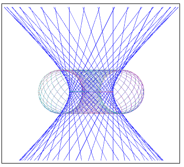

# Hopf-fibration-hyperboloid

This site shows a visualization of the Hopf fibration.
Visualization is performed both for Hopf circles and for straight lines 
taken instead of these circles. As a result of such visualization, 
a hyperboloid appears instead of a torus.
 
The visualization was performed using quantum rotations on the Riemann-Bloch sphere.

Video that shows how to work with the program is provided on this website
  <a href ="https://www.youtube.com/watch?v=cxOhQ8L-8dk" target="_blank">video</a>.

Screenshot of this program

